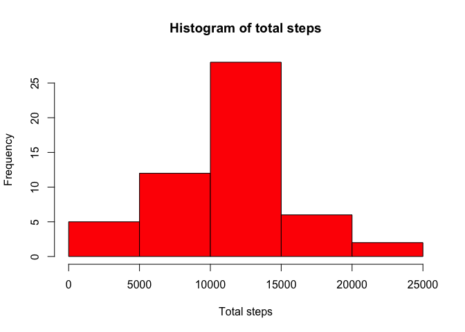
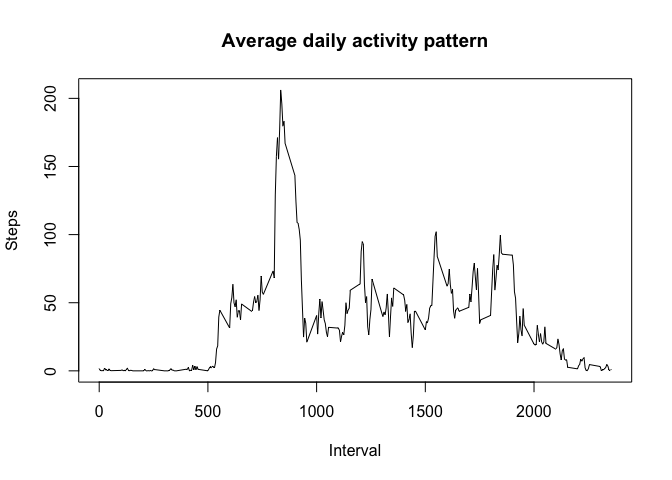
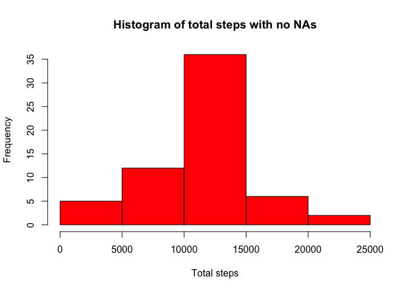

# Reproducible Research: Peer Assessment 1


## Loading and preprocessing the data

First read data using colClasses to convert data column to Date. No need for any further transformation/preprocessing.


```r
activity_df <- read.csv("activity.csv", colClasses = c("date" = "Date"))
```

## What is mean total number of steps taken per day?

For this part of the assignment, first we will sum all steps taken per day.


```r
steps_by_day <- aggregate(steps ~ date, data = activity_df, FUN = sum)
```

Histogram of total number of steps taken each day

```r
hist(steps_by_day$steps, col = "red",
     main = "Histogram of total steps",
     xlab = "Total steps")
```

 

Calculate and report the mean and median of the total number of steps taken per day


```r
steps_mean <- mean(steps_by_day$steps, na.rm = TRUE)
steps_mean
```

```
## [1] 10766.19
```

```r
steps_median <- median(steps_by_day$steps, na.rm = TRUE)
steps_median
```

```
## [1] 10765
```

The mean of the total number of steps is: 10766.19

The median of the total number of steps is: 10765

## What is the average daily activity pattern?

Time series plot of the 5-minute interval (x-axis) and the average number of steps taken, averaged across all days (y-axis). First generate a new dataframe with the mean of steps for each interval in each day.


```r
average_daily_activity <- aggregate(steps ~ interval, data = activity_df, FUN = mean)

plot(average_daily_activity$interval, average_daily_activity$steps, type = "l", 
     main = "Average daily activity pattern", 
     xlab = "Interval", ylab="Steps")
```

 

After, get the interval with the max num steps.


```r
max_steps_avg <- max(average_daily_activity$steps)
int_max_num_steps <- average_daily_activity$interval[average_daily_activity$steps == max_steps_avg]

int_max_num_steps
```

```
## [1] 835
```

The 5-minute interval, on average across all the days in the dataset, that contains the maximum number of steps is: 835

## Imputing missing values

Calculate the total number of missing values in the dataset.


```r
na_df <- subset(activity_df, is.na(steps))
total_na <- nrow(na_df)

total_na
```

```
## [1] 2304
```

Total number of rows with NAs is: 2304

Strategy for filling in all of the missing values in the dataset: mean for the 5-minute interval.

Create a new dataframe (copy of the original one) and update the NA values with the mean of all the intervals in all days calculated before in the average_daily_activity dataframe.


```r
activity_df_no_nas <- activity_df

for(i in 1:nrow(activity_df_no_nas)) {
     if(is.na(activity_df_no_nas[i, 1])) {
          interval <- activity_df_no_nas[i, 3]
          steps_interval_avg <- 
               average_daily_activity[average_daily_activity$interval == interval, 2]
          
          activity_df_no_nas[i, 1] <- steps_interval_avg
     }
}
```

Make a histogram of the total number of steps taken each day and Calculate and report the mean and median total number of steps taken per day.


```r
steps_by_day_no_nas <- aggregate(steps ~ date, data = activity_df_no_nas, FUN = sum)

hist(steps_by_day_no_nas$steps, col = "red",
     main = "Histogram of total steps with no NAs",
     xlab = "Total steps")
```

 

Calculate and report the mean and median of the total number of steps taken per day


```r
steps_mean_no_nas <- mean(steps_by_day_no_nas$steps)
steps_mean_no_nas
```

```
## [1] 10766.19
```

```r
steps_median_no_nas <- median(steps_by_day_no_nas$steps)
steps_median_no_nas
```

```
## [1] 10766.19
```

The mean of the total number of steps is: 10766.19

The median of the total number of steps is: 10766.19

These values do not differ from the estimates from the first part of the assignment. The impact of imputing missing data on the estimates of the total daily number of steps is that besides the amount of steps have increased, the mean and the median do not change significantly.

## Are there differences in activity patterns between weekdays and weekends?

Create a new factor variable in the filled-in missing values dataset with two levels ??? ???weekday??? and ???weekend??? indicating whether a given date is a weekday or weekend day.


```r
activity_df_no_nas$daytype <- ifelse(weekdays(activity_df_no_nas$date) %in% c("Saturday","Sunday"), "weekend", "weekday")
```

Make a panel plot containing a time series plot (i.e. type = "l") of the 5-minute interval (x-axis) and the average number of steps taken, averaged across all weekday days or weekend days (y-axis).

First we will create a new dataframe with the average number of steps taken by the 5-minute interval and the new factor variable just created.


```r
average_daily_activity_daytype <- aggregate(steps ~ interval + daytype, data = activity_df_no_nas, FUN = mean)
```

Plot the panel using lattice.


```r
library(lattice)
xyplot(steps ~ interval | factor(daytype), data=average_daily_activity_daytype,
       xlab="Interval", ylab="Number of steps",layout = c(1, 2), type="l")
```

 
